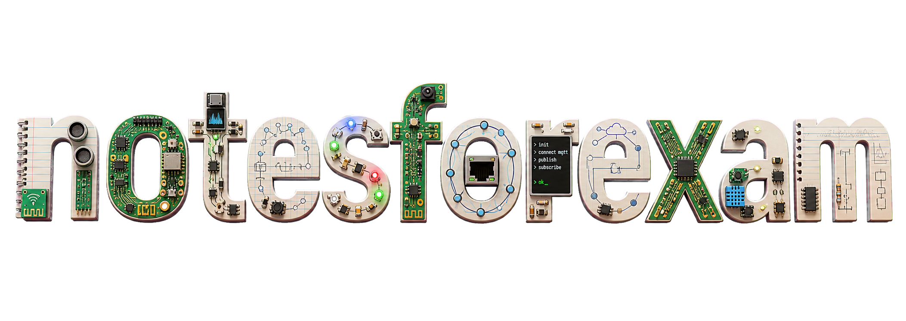
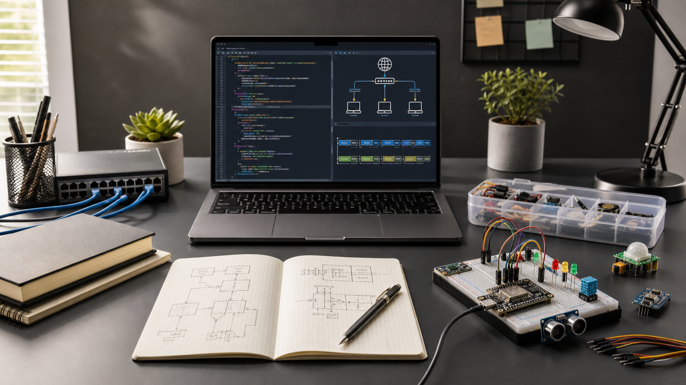

Gode noter til eksamen

## Mapper

- `prog/` - programmering: C++, CMake, MQTT, Catch2, logging, hashing, encryption og shell scripts
- `network/` - netværk: subnetting, switching, ARP, STP, routing, SRX/vSRX, DHCP, DNS, NAT, Wireshark, MQTT, SSH og ESP32
- `elektronik/` - indlejrede systemer og elektronik: Ohms lov, effekt, Wheatstonebro, Thevenin, batteri, ESP32, sensorer, filtre, oscilloskop, RC, 555 timer og binær logik
